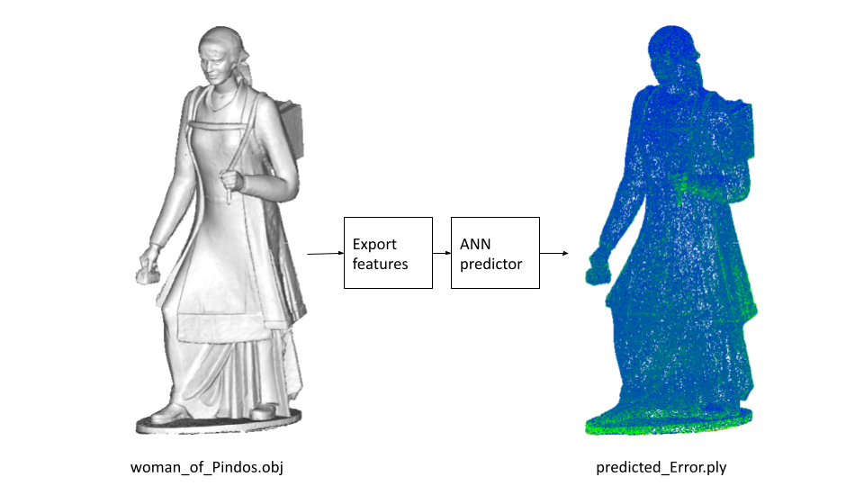

# ANN_c2c_error_prediction

A pretrained network for predicting the per vertex geometric error of the manufactured object produced by the binder jetting printer ZPrinter 450. 

## Dependencies

For ann_predictor.py
- Python 3.6 or later
- Tensorflow 2.7.0
- Pandas 1.3.4
- Numpy
- Joblib 1.1.0

For export_CSV_from_OBJ.py
- Python 3.6 or later
- Numpy
- IGL
- Scipy


## Reference

ArxivX link

## extract_CSV_from_OBJ.py

Exports the features in a .csv file, given any .obj model as input.

```sh
python export_CSV_from_OBJ.py yourModel.obj
```

## ann_predictor.py

Produces a .ply file of the vertices and the predicted per vertex dimensional error (in milimeters), given a .csv file of the features of any model as input. 

```sh
python ann_predictor.py yourData.csv
```


